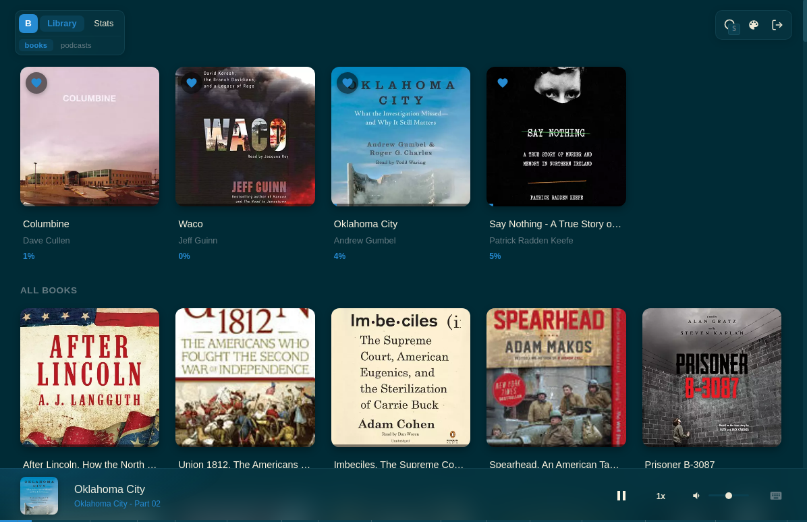
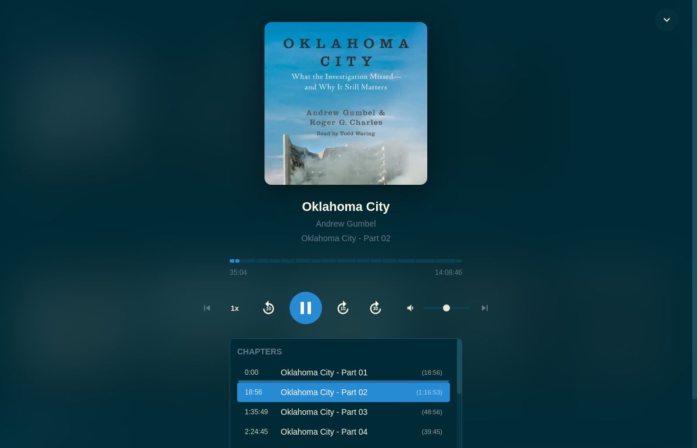
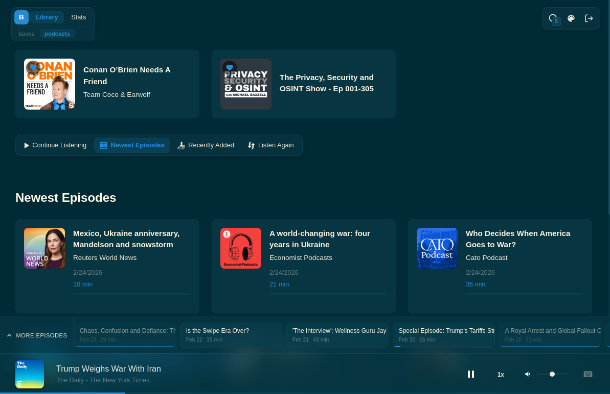
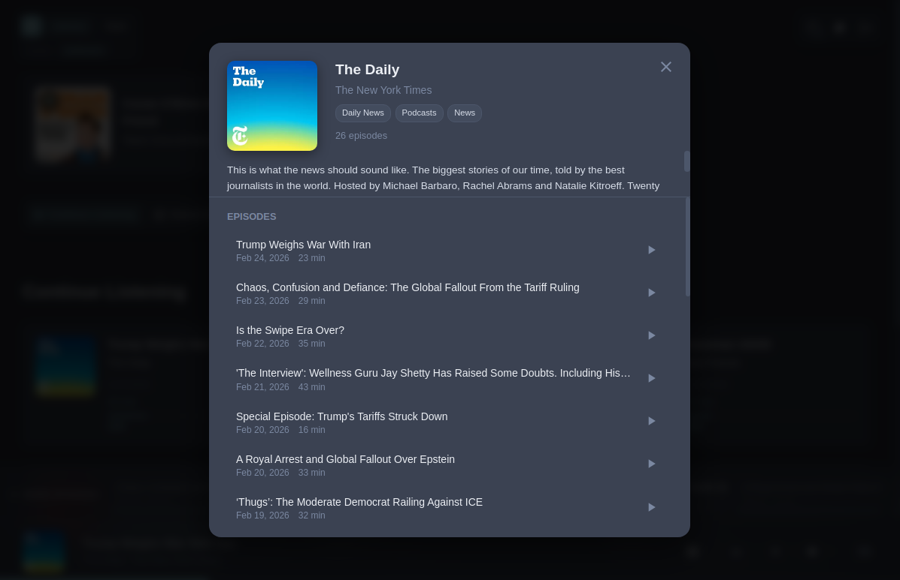
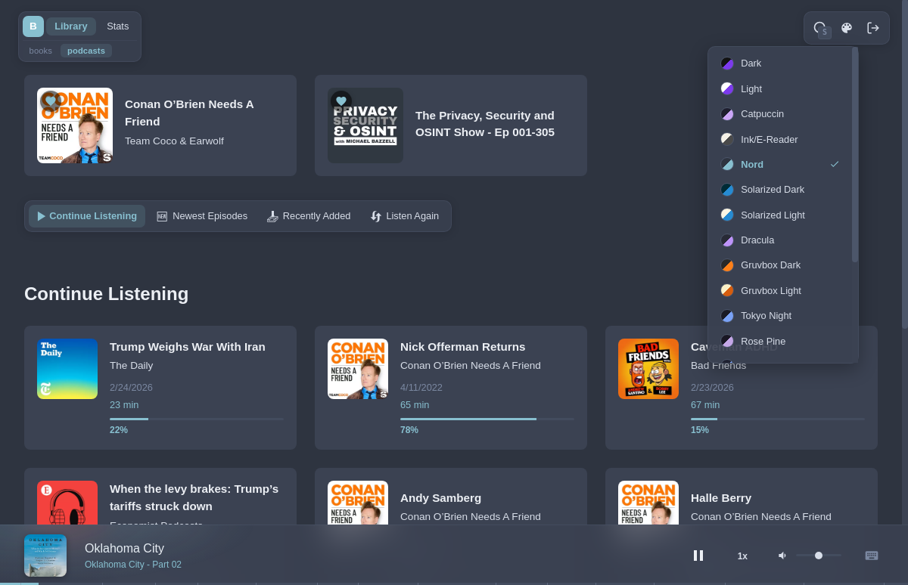

# Boek - Audiobookshelf Player for Linux

A clean, minimal desktop player for [Audiobookshelf](https://www.audiobookshelf.org/) on Linux. Connect to your self-hosted server and listen to audiobooks and podcasts from your desktop.

Available as **AppImage** (works on any Linux distro) and **.deb** (Ubuntu/Debian).

  

---

## Getting Started

1. Download the AppImage or .deb from the releases page.
2. Install or run it.
3. Enter your Audiobookshelf server address (e.g. `http://192.168.1.50:13378`), username, and password.
4. You're in.

Your login is remembered between sessions -- no need to sign in again after restarting.

---

## Features

### Library Browsing

- Browse your audiobook and podcast libraries with cover art and reading progress.
- Switch between libraries using the tabs at the top of the screen.
- Finished items are marked with a checkmark badge.

### Audio Player

- **Mini player** -- Always visible at the bottom of the screen with play/pause, speed control, volume, and a progress bar with chapter markers.
- **Full-page player** -- Click the cover art in the mini player to open an immersive full-screen view with large cover art, a seekable progress bar, transport controls, and a scrollable chapter list.
- **Resume playback** -- Picks up right where you left off, even if you listened on another device.
- **Playback speed** -- Choose from 0.5x to 3x.
- **Chapter navigation** -- Jump between chapters with dedicated buttons, or click any chapter in the list.
- **Multi-file books** -- Seamlessly handles audiobooks split across multiple files.

  

### Podcasts

- Personalized shelves: Continue Listening, Newest Episodes, Recently Added, Listen Again.
- Full episode list with progress tracking per episode.
- **Episode recommendations** -- When listening to a podcast, a scrollable bar above the mini player shows other episodes from the same podcast for quick switching.

  

  

### Favourites

- Mark books or podcasts as favourites with the heart button.
- Favourited items are pinned to the top of the library for quick access.
- Favourites are saved locally and persist across restarts.

### Search

- Search across all your libraries at once -- books, podcasts, episodes, authors, and series.
- Press **S** or **Ctrl+K** to open search from anywhere.

### Listening Stats

- **Overview** -- Total listening time, daily average, current streak, and a 30-day chart.
- **Day-of-week breakdown** -- See which days you listen the most.
- **Top 10** -- Your most-listened items ranked by time.
- **Session history** -- A log of recent listening sessions.

### Live Sync

Your progress syncs with the server in real time. Listen on your phone during a commute, then continue on your desktop -- progress updates automatically.

### Themes

18 built-in themes. Click the palette icon in the top-right to cycle through them, or right-click it for a full list.

Includes: Dark, Light, Nord, Dracula, Tokyo Night, Rose Pine, Gruvbox, Solarized, Catpuccin, Ink (e-reader style), High Contrast, and more.

  

---

## Keyboard Shortcuts

| Key | Action |
|-----|--------|
| `Space` / `K` | Play / Pause |
| `Left` / `Right` | Skip back / forward 10s |
| `Shift + Left` / `Shift + Right` | Skip back / forward 30s |
| `Up` / `Down` | Volume up / down |
| `M` | Mute / Unmute |
| `X` | Cycle playback speed |
| `F` | Toggle full-page player |
| `[` / `]` | Previous / Next chapter |
| `S` or `Ctrl+K` | Open search |
| `Escape` | Close overlays |

A shortcuts reference is also available by clicking the keyboard icon in the mini player.

---

## Requirements

- A running [Audiobookshelf](https://www.audiobookshelf.org/) server (v2.x)
- Linux (x64)

---

## License

MIT
